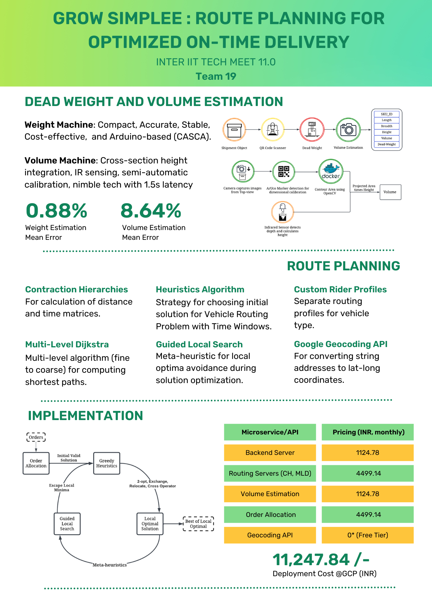

<h1 align = "center"> Route Planning for Optimised On-Time Delivery </h1>
<h3 align="center"> Inter IIT Tech Meet 11.0 (IIT Kanpur) </h3>
<h5 align="center">IIT Bhubaneswar's Submission</a> (11 February 2023) </h5>

<h2 id="content"> 📝 Contents </h2>

 1. [Problem Statement](#problem)
 2. [Proposed Solution](#solution)
 3. [Usage Instructions](#usage)

<h2 id="problem"> 🌟 Problem Statement </h2>

Given `n` items to deliver and a fleet of `m` riders, (`n` > `m`), and some `k` dynamically added pickup points. Optimize for `n` items and at most `m` tours,
also considering the cases where `k` >= `0` and points are added or deleted from the original route .

The Objectives are:

1. A tool that accurately estimates the `length`, `breadth`, `height` and `volumetric weight` of an item with a small margin of error. The product developed 
should be easy to use, reproduceable and reusuable. Bonus points will be awarded, if erroneous objects can be flagged on conveyor.

2. An effective route planning system to cluster items into different tours that maximizes number of items delivered in each route of tour,
`maximizing the on time delivery percentage and minimizing overall distance travelled` on all routes combined with minimum tours/riders
involved in fulfillment. While route planning, maximizing output of rider by smart bag creation/clustering to get the best out of riders and routes.
This Route planning system should also have the ability to add pickup points dynamically for multi pickup cases by selecting the correct
rider/tour, reroute their routes to cater pickups along with their on going tour, and considering the rider bag capacity as well. 

3. A basic platform ( `web` / `app` ) to fit in all these objectives together where points can be added or removed dynamically. The app is expected to
support navigation on map by prompting the best route between any two points on the tour for riders. The app needs to be integrated with Challenge-1 for rider-bag problem.

:point_right: Click <a href="https://drive.google.com/file/d/1VVM5SiA0mxap4M-FpOdtfUEJxQu6s27D/view?usp=share_link">here</a> to get a detailed problem statement. 

<h2 id="solution"> :brain: Proposed Solution </h2>

 

<h2 id="usage"> 📋 Usage Instructions </h2>

Check out each repository's `README.md` to know about the specific usages. 

